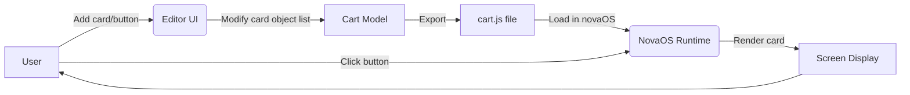

# hyperNova: A HyperCard-like Editor for novaOS

**Executive Summary:** hyperNova is a proposed in-system editor for the _novaOS / nova64_ fantasy console, modeled on HyperCard’s “stacks of cards” paradigm【43†L208-L213】. It will enable users to create interactive card-based interfaces (e.g. presentations, simple apps or games) using visual tools and a built-in scripting language. Users can add cards and stacks, drag-and-drop UI objects (buttons, text fields, images, sprites) onto cards, and attach scripts to define behavior (e.g. navigating between cards, updating fields, playing sounds). The editor will integrate with the existing sprite editor so graphics and assets can be imported directly into cards. Projects will be exported as **cart.js** files (JSON/JS format) that describe the stack structure, objects, scripts, and embedded assets. At runtime, a loader will parse `cart.js`, create NovaOS UI elements, and bind scripts to the fantasy-console API (graphics, input, audio, etc.). The design emphasizes visual ease-of-use (minimal learning curve, WYSIWYG editing) while leveraging NovaOS’s graphics and sound APIs. Security is handled by sandboxing user scripts within the fantasy-console runtime. We provide a detailed roadmap with milestones, user stories, feature breakdown, schema design, runtime integration plan, code snippets for export and load, comparison of design options, sample cart examples, testing/QA checklist, and mermaid diagrams of architecture and workflow.

This design is inspired by HyperCard’s architecture (HyperCard “combines a flat-file database with a graphical, flexible, user-modifiable interface” and a built-in scripting language【43†L171-L173】) and by modern fantasy consoles (e.g. PICO-8’s text-based cart format【58†L99-L101】). It assumes some NovaOS runtime APIs (graphics drawing, input, asset loading, etc.) – wherever exact NovaOS calls are unknown, we mark them as _unspecified_ and discuss intended behavior. The goal is to make stack-oriented UI creation **visually intuitive** (drag/drop, menus for objects) and to allow at least creating a simple presentation/slideshow with minimal effort, as requested by the team.

## Project Goals and Scope

- **Create hyperNova**, an in-system HyperCard-like editor integrated into novaOS, with WYSIWYG card and stack editing.
- **Export format:** Projects saved as `cart.js` files containing JSON/JS that NovaOS can load and run.
- **Ease of Use:** The editor UI should be visually clear and easy, integrating the sprite editor so that creating e.g. a presentation slide deck is straightforward.
- **Compatibility:** cart.js must be compatible with novaOS/nova64 APIs; design for future extension and backward compatibility.
- **Security:** User scripts run in a sandboxed environment; no unauthorized access to host system.
- **Persistence:** Support saving/loading projects (stacks) and allow runtime persistence if needed.
- **Sample Output:** Provide example carts, test cases, and QA plan to validate functionality.

## User Stories

- _As a content creator_, I want to **create new stacks and cards**, giving each a title and background, so that I can organize a series of pages or slides.
- _As a user_, I want to **add buttons, images/sprites, text labels, and input fields** to a card by dragging icons or using menus, so I can design interactive screens.
- _As a user_, I want to **drag images from the sprite editor** into my card, so I can reuse existing graphics (sprites, tiles, backgrounds).
- _As a user_, I want to **write or edit scripts attached to buttons/fields/cards**, using a simple scripting language, to define interactions (e.g. “go to next card” or validate input).
- _As a user_, I want to **navigate between cards/stacks**, using both built-in navigation (first/last card, go to card by number) and button scripts (e.g. `goToCard("card3")`).
- _As a user_, I want to **test/play my stack in the novaOS runtime** directly from the editor, to quickly verify behavior.
- _As a user_, I want to **export** my project as a `cart.js` file and later **import** it back, so I can save/share my work.
- _As a developer_, I want to **prompt an AI agent via CLI** to implement features (e.g. “build a drag-and-drop UI for cards”), to automate development.

## Required Features

- **Card Editor UI:** Visual editor to layout each card. Must allow:
  - Adding/placing **buttons**, **text fields**, **labels**, **images/sprites** onto a card by drag/drop or context menu.
  - Resizing and positioning of objects with mouse.
  - Editing object properties (label text, font, color, id, target card for navigation, etc.).
- **Stacks and Cards:** Support multiple stacks and multiple cards per stack. User can create, delete, rename cards/stacks.
- **Buttons & Fields:** Buttons trigger scripts on click. Text fields allow user input (for interactive demos).
- **Scripting:** A simple scripting editor. Each object and card can have an attached script (event handlers, e.g. `onClick`). Scripting language could be JavaScript or a HyperTalk-like subset. Scripts define logic (navigate cards, update fields, play sounds, etc.).
- **Assets and Sprite Integration:** Integrate with the existing sprite editor so users can place sprites/images on cards. The editor should list imported assets for use.
- **Navigation:** Built-in commands and UI for navigation (first/last card, stack controls) plus script-based (e.g. `goNextCard()`, `goToCard(id)`).
- **Export/Import:** Export stacks as a `cart.js` file (or set of files) containing the project data (schema below). Import should read a `cart.js` back into the editor UI.
- **NovaOS Runtime Bindings:** Map hyperNova objects and events to novaOS/nova64 graphics and input APIs so the cart runs as intended. (Detailed API mapping below.)
- **Persistence:** Ability to save the cart (in editor) and also store any runtime state if needed (e.g. field contents).
- **UX/UI:** Clean interface: toolbar/menu for common actions (new card, delete card, export, etc.), properties panel for selected object, and integration with sprite editor panel. It should be easy for even non-coders to create a slideshow or simple app (“slides” = cards).

## Cart.js Schema (JSON/JS Format)

We define a JSON-based schema for exported carts. A cart file (`cart.js`) contains all stacks, cards, objects, scripts, and assets. For example:

```json
{
  "version": 1,
  "name": "MyProject",
  "stacks": [
    {
      "id": "stack1",
      "title": "Main Stack",
      "cards": [
        {
          "id": "card1",
          "title": "Welcome Card",
          "objects": [
            {
              "type": "text",
              "id": "txt1",
              "x": 10,
              "y": 10,
              "text": "Welcome!",
              "font": "Sans",
              "size": 16
            },
            {
              "type": "button",
              "id": "btnNext",
              "x": 50,
              "y": 100,
              "width": 100,
              "height": 40,
              "label": "Next",
              "script": "goToCard('card2');"
            }
          ]
        },
        {
          "id": "card2",
          "title": "Second Card",
          "objects": [
            { "type": "text", "id": "txt2", "x": 10, "y": 10, "text": "This is the second card." },
            { "type": "image", "id": "imgLogo", "x": 30, "y": 50, "asset": "logo" }
          ]
        }
      ]
    }
  ],
  "assets": {
    "images": {
      "logo": { "format": "png", "data": "<base64-encoded-image-data>" }
    },
    "sounds": {
      "ping": { "format": "wav", "data": "<base64-audio-data>" }
    }
  }
}
```

- **version:** Schema version number for migration/back-compat checks.
- **name:** (Optional) human-readable name of the cart.
- **stacks:** Array of stack objects. Each stack has an `id`, `title`, and array of `cards`.
- **cards:** Each card has an `id`, optional `title`, and an array of `objects`.
- **objects:** Each object on a card has a `type` (e.g. `"text"`, `"button"`, `"field"`, `"image"`), coordinates `x,y`, size (if applicable), and other properties:
  - **text object:** `text`, `font`, `size`, `color`.
  - **button object:** `label`, and a `script` string (HyperTalk/JS code) to execute on click.
  - **field object:** initial `text` value, and a `script` (e.g. onChange).
  - **image object:** refers to an asset ID (`"asset": "logo"`) defined in `assets`.
- **assets:** Maps for external data. We embed assets directly in the cart for portability. Images and sounds are base64-encoded. The runtime loader will decode and register these. (Alternatively, a URI or filename could be used if NovaOS supports file references.)

This JSON data can be exported as a JS file (e.g. `export default { ... };` or simply setting a global variable) so that the novaOS runtime can load it. The exporter will generate the JSON string (or JS object literal) in a file named `cart.js`. The loader (runtime) will parse this structure to recreate stacks and objects.

## Runtime API Bindings (to novaOS/nova64)

At runtime, the NovaOS/nova64 system must display cards and handle input based on the cart data. We assume NovaOS provides low-level APIs for graphics, sprites, UI, and input. We list expected bindings (exact call names are _unspecified_ since NovaOS docs are not public):

- **Drawing/Graphics:** To render text, shapes, and sprites.
  - e.g. `novaOS.drawText(x,y,string,font,size,color)` – draw text.
  - `novaOS.drawRect(x,y,w,h,color)`, `novaOS.fillRect(...)` – shapes.
  - `novaOS.drawSprite(spriteId, x, y)` – draw a sprite (from sprite editor).
  - (If NovaOS has a GPU or canvas API, use that.)
- **UI Elements:** Buttons and fields may be drawn manually or via UI calls.
  - e.g. `novaOS.drawButton(x,y,w,h,label)` (unspecified). Or the runtime could draw the button and listen for clicks.
  - `novaOS.drawField(x,y,w,h,text)` for text input fields.
- **Input Handling:** Monitor mouse clicks and key presses.
  - e.g. `novaOS.onMouseClick(callback)` or a polling API. The loader will detect if click coordinates overlap a button’s area, and run that button’s script.
  - `novaOS.onKeyPress(callback)` (for keyboard in fields).
- **Navigation/Control:** Likely functions to change the visible card.
  - e.g. `novaOS.showCard(cardId)` or simply the loader can manage the current card index.
- **Assets:** Load and use assets.
  - e.g. after loading an image asset, `novaOS.drawImage(imgData, x,y)` or create a sprite sheet from data.
  - `novaOS.playSound(soundId)` – play a sound asset.
- **Storage/Persistence:** If needed, saving data.
  - e.g. `novaOS.saveFile(path, data)` or `novaOS.setUserData(key, value)`, if NovaOS supports persistent storage. (Marked _unspecified_ if unknown.)
- **Timing/Animation:** Potentially `novaOS.wait(ms)` or an event loop. Scripts might use `wait` or timers (HyperCard had `wait` commands).
- **Other:** If NovaOS has a message or alert, e.g. `novaOS.alert(msg)` (unspecified), could be used in scripts.

Where exact API calls are unknown, we note them as **(unspecified)**. The hyperNova runtime code will wrap these calls, e.g.:

```js
// Example pseudo-code for loader
function showCard(card) {
  clearScreen();
  card.objects.forEach(obj => {
    switch (obj.type) {
      case 'text':
        novaOS.drawText(obj.x, obj.y, obj.text, obj.font, obj.size);
        break;
      case 'button':
        novaOS.drawButton(obj.x, obj.y, obj.width, obj.height, obj.label);
        // register click handler:
        buttonHandlers.push({
          x: obj.x,
          y: obj.y,
          w: obj.width,
          h: obj.height,
          script: obj.script,
        });
        break;
      case 'image':
        let imgData = assets.images[obj.asset];
        novaOS.drawImage(imgData, obj.x, obj.y);
        break;
      // etc.
    }
  });
}
```

Script handlers (like `obj.script`) will be evaluated in a sandboxed interpreter context, where built-in commands such as `goToCard(id)` are mapped to internal functions (that call `showCard` on the target card) via the NovaOS API. For instance, `function goToCard(id) { /* find card and call showCard */ }`.

## Security / Sandboxing

User-written scripts must not break the system. The runtime should execute scripts in a controlled sandbox:

- Disallow any file I/O, networking, or arbitrary OS calls from user scripts. They should only interact with the provided NovaOS fantasy-console API (graphics, input).
- If using JavaScript for scripts, run them in a restricted context (e.g. an isolated VM with only safe APIs exposed). Or, if using a custom script parser, ensure it has no `import` or dangerous operations.
- Prevent scripts from entering infinite loops: runtime should allow yielding (e.g. `wait`) or preempt after a certain time, to avoid hanging the system.
- Validate the `cart.js` data on load: ensure objects have valid types/fields, no malicious code injection (though it's internal).
- Optionally, require a `"signature"` or hash check for exported carts, but not strictly needed if running locally. Mentioning it as a consideration.

In summary, **user scripts run in a NovaOS-provided sandbox**, with only the needed bindings (UI navigation, drawing, sound). Any unknown or dangerous calls are simply not provided.

## Persistence

Persistence in hyperNova has two facets:

1. **Project Persistence (Editor Side):** The editor must save and load the current project (stack of cards) as `cart.js`. The user action “Save” writes out the JSON/JS file; “Load” reads it back into the editor interface. This uses NovaOS’s file APIs or local filesystem (e.g. `novaOS.saveFile("proj.cart.js", data)` – _unspecified_).
2. **Runtime State (During Play):** If needed, the cart can store transient or game state. For example, text fields on cards naturally retain their content as part of the card state. If longer-term persistence is needed (e.g. saving progress between sessions), hyperNova could use NovaOS’s persistent storage (e.g. saving a small JSON of variables). As a simple solution, we can allow scripts to write to a (sandboxed) `novaOS.setUserData(key, value)` store (unspecified) and `novaOS.getUserData(key)` on reload.

By default, all card data (including field contents if treated as object state) will be in memory; exporting again will capture those values.

Finally, for backward compatibility, we include a `"version":1` field in `cart.js`. If future updates change the schema, the loader can detect an old version and either migrate it or warn the user to upgrade their editor/stack format.

## Asset Pipeline

hyperNova must handle user assets (images, sprites, sounds, music). We outline the pipeline:

- **Importing Assets:** Within the editor, users should be able to import or create assets:
  - **Sprites/Images:** The sprite editor creates images and sprite sheets. hyperNova can list these in an “Asset Library” panel. Users can drag an image/sprite from the library onto a card, creating an image object.
  - **Audio:** If NovaOS supports sound, allow importing audio clips (WAV/OGG). The user might press a “Add Sound” button and select a file.
  - Internally, when an asset is added, hyperNova reads it and stores it as base64 or raw data in the project model.

- **Referencing Assets in Cart:** In the JSON schema above, assets are included under the `"assets"` section. We embed them as base64 strings (or data URIs) so that the cart is self-contained. For example:

  ```json
  "assets": {
    "images": {
      "logo": {"format":"png","data":"iVBORw0KGgoAAAANSUhEUgAA..."}
    },
    "sounds": {
      "ping": {"format":"wav","data":"UklGRiQAAABXQVZFZm10IbA..."}
    }
  }
  ```

  The `"asset"` field on an image object (e.g. `"asset": "logo"`) refers to these IDs.

- **Exporting Assets:** The cart.js exporter will take any image objects or audio objects in the stacks and include their data in the assets map. If using base64, this can make the file large for many/huge assets; one could also opt to store just file paths if NovaOS allows bundling, but base64 ensures portability (the entire project is one file). As the PICO-8 forum notes, other systems sometimes store carts as plain text or even embed in PNG images for sharing【58†L99-L101】. We choose JSON/text for simplicity.

- **Runtime Loading:** When the cart is loaded in novaOS, the loader will iterate `assets.images` and decode each `"data"` into an image object (e.g. create a texture in GPU memory) and make it available under the asset ID. Similarly for sound data (decode to audio buffer). Then, when `novaOS.drawImage` or `novaOS.playSound` is called, it uses the pre-loaded data.

## Editor UI/UX

The editor’s user interface should be clear and efficient. A suggested layout:

```
┌───────────────────────────────────────────────────────────┐
│ File | Edit | Stack | Card | Object | Help  (Menu Bar)   │
├───────────────────────────────────────────────────────────┤
│ [Stacks/Slides]                                         ] │  (List of stacks/cards)
│ [Title: ___________]  [Add Card] [Delete Card] [Copy]   ] │
│                                                           │
│ +-------------------------------------------------------+ │
│ |             Card Canvas (WYSIWYG Editor)             | │  (Canvas shows current card)
│ |  [Toolbar: Select/Drag, Button, Field, Image, Text]  | │
│ |                                                       | │
│ |    Welcome to hyperNova!                              | │
│ |                                                       | │
│ |    [Button: Next >]                                   | │
│ |                                                       | │
│ +-------------------------------------------------------+ │
│ [Properties Panel:                                     ] │  (When object selected)
│   - ID:  btnNext                                        │
│   - Label: "Next"                                       │
│   - Position: (50,100)  Size: (100×40)                 │
│   - Script: onClick: goToCard("card2");                │
│   - (Color, Font, etc.)                                │
│                                                         │
│ [Asset Library (Sprites/Images/Sounds)]                 │
└───────────────────────────────────────────────────────────┘
```

- **Card Canvas:** The main area shows the current card exactly as it will appear at runtime. Users can select the object tool and click to add a new object (button, text, etc.), or drag existing objects around. Snap-to-grid or align guides are optional features to assist layout.

- **Tool Palette:** Icons or buttons to add new objects: **Button**, **Field (text input)**, **Text (label)**, **Image/Sprite**. Clicking one and then clicking on the canvas places it.

- **Stacks/Slides List:** A sidebar lists stacks and cards (like slides). It allows adding/removing stacks/cards. This makes creating a presentation easy: each card is one slide.

- **Properties Panel:** When an object on the card is selected, a properties sidebar shows editable fields (position, size, label text, script text, etc.). Changes are immediately reflected on the card.

- **Asset Library Panel:** Shows imported assets (thumbnails). Users can drag an image from this library onto the card, creating an image object with that asset.

- **Script Editor:** When editing a script (e.g. onClick of a button), a small code editor appears (or a separate pane) with syntax highlighting (if feasible) for the chosen scripting language (likely JavaScript). It should support basic editing (copy/paste).

- **Navigation Controls:** Buttons or menu items for “Go to Card >”, “Back”, etc., to test the sequence. Possibly a “Play” button to simulate the stack in the editor (switch to runtime mode).

- **Integrating Sprite Editor:** The sprite editor (existing NovaOS tool) can be a docked panel or invoked when adding an Image object. It should share the same coordinate space. For example, a user might open the sprite editor, draw a sprite or select one, and then in hyperNova’s asset library it appears for use.

- **Presentation Support:** Since users want to create presentations easily, include a quick “New Slide” or “Duplicate Slide” action, and a simple slide sorter (like PowerPoint) is helpful. However, at minimum the card list functions as slides. Buttons like “Next” can have default actions to go to the next card.

The key UX principle is **WYSIWYG**: what you arrange visually is what runs. This matches HyperCard’s ease (HyperCard used drag-drop placement and on-the-fly layout【43†L216-L224】). We avoid requiring code to position things.

## CLI/Agent Prompts for Implementation

For each milestone/task, we define prompts that an AI agent (or developer) could use to implement it. Prompts should be precise and actionable.

1. **Setup & API Stubs:**  
   _Prompt:_ “Create a basic project structure for hyperNova. Define placeholder functions for NovaOS API calls (e.g. `drawText`, `drawButton`, `onClick`, `showCard`) so that editor code can call them. Use comments to mark these as unspecified. Write a simple HTML/JS scaffold (or Lua files if novaOS uses Lua) that can display an empty canvas and call `clearScreen()` and `update()`. Ensure the code runs without errors.”

2. **Design Cart Schema:**  
   _Prompt:_ “Design the JSON schema for the `cart.js` file. It should include stacks, cards, objects, scripts, and assets as discussed. Implement a JavaScript class or object model in code that can build a cart structure in memory (with methods `addStack`, `addCard`, `addObject`, etc.). Provide code to serialize this structure to JSON or JS text. Include sample code that creates one stack, one card, and one button object.”

3. **Runtime Loader Prototype:**  
   _Prompt:_ “Write a runtime loader function `loadCart(cartData)` that takes the JSON cart structure (like above) and renders the first card. The loader should interpret objects: for each object, call the NovaOS API stub (e.g. `drawText`, `drawButton`). If objects have scripts, store them in a map. For example, pressing a drawn button should later trigger evaluation of its script. Focus on the rendering logic and navigation: implement `goToCard(cardId)` to switch cards. Write in JS (or the target language). Use simple console logs or placeholder graphics to test functionality.”

4. **Card Editor UI Skeleton:**  
   _Prompt:_ “Create a GUI window for the card editor. Use HTML/CSS/JS or the novaOS UI framework if available. Divide it into a main canvas (for card layout), a side panel (object properties), and a toolbar (for selecting object types to add). Implement the ability to click on the canvas to create a new object: e.g. if ‘Button’ is selected in the toolbar, clicking the canvas adds a new button object at that location. Outline the data model update as well (e.g. adding to the current card’s object list).”

5. **Object Manipulation:**  
   _Prompt:_ “Implement dragging and resizing of objects on the card canvas. Users should be able to click and drag an object to move it, and use corner handles to resize. Update the object’s `x,y,width,height` in the model as they move it. Provide code that attaches mouse event handlers to allow these manipulations. Test that object properties update live as the object moves.”

6. **Scripting Editor:**  
   _Prompt:_ “Add a scripting editor UI for objects. When a button or field is selected, provide a multi-line text box for its script. The user can type event code (e.g. JavaScript) into it. On save/blur, update the object’s `script` property in the data model. Show how the loader will later execute this script in context (e.g. using `eval` or a JS Function, assuming sandboxing). Include code that links an object’s `onClick` event to evaluating its script with the NovaOS API context.”

7. **Sprite Editor Integration:**  
   _Prompt:_ “Integrate the existing sprite editor. When adding an image object, open a dialog or panel listing available sprites/images. Let the user pick one; the editor then adds an image object with that asset ID. Demonstrate this by mocking a sprite list (e.g. array of names) and allowing drag/drop onto canvas. Ensure the asset is added to the cart’s asset table (base64 data) on export.”

8. **Asset Pipeline Implementation:**  
   _Prompt:_ “Implement the asset embedding in the exporter. Write code in the export function that reads any image or sound objects from the model, loads their file data (e.g. using FileReader or a base64 encoder), and inserts them into the `assets` section of the cart structure. The asset entries should include format and data. Then output the final JSON. Also, in the loader, write code to decode these assets: e.g. create HTML Image objects or Audio objects from the base64 data and store them in a lookup by asset ID.”

9. **Export & Import Functionality:**  
   _Prompt:_ “Implement ‘Save’ and ‘Load’ commands in the UI. ‘Save’ should serialize the current project to `cart.js` and prompt the user to download or write to file. ‘Load’ should let the user open an existing `cart.js`, parse the JSON, and populate the editor model (recreate stacks, cards, objects with their properties). Provide code using file input/output APIs.”

10. **Navigation and Testing Mode:**  
    _Prompt:_ “Add navigation controls: e.g. buttons ‘<<’, ‘<’, ‘>’, ‘>>’ to move between cards in a stack. Implement their actions by calling the loader’s `showCard` with the previous/next card. Also add a ‘Play’ button: when clicked, it switches the interface to runtime mode, rendering the stack as if it were the actual app (or simply calls `loadCart` and hands off control). Provide code to toggle between edit mode and play mode.”

11. **Testing & QA Automation:**  
    _Prompt:_ “Generate test cases for the features. For example, write a script that programmatically creates a stack with 3 cards, each with a button; set each button’s script to go to the next card. Save this as `cart.js`, then load it and simulate clicks on each button in sequence, verifying that the card advances correctly. Automate checking that properties (positions, labels) match between save and load.”

Each prompt above is meant to be given to a coding assistant or developer to implement that piece of the system.

## Step-by-Step Implementation Roadmap

| Milestone             | Description                                                                             | Dependencies | Effort |
| --------------------- | --------------------------------------------------------------------------------------- | ------------ | ------ |
| 1. Define Data Model  | Specify `cart.js` schema and internal classes. Create objects for Stack, Card, Objects. | None         | Low    |
| 2. Runtime Loader     | Implement function to load a cart (JSON) and render first card. Bind NovaOS API stubs.  | (1)          | Medium |
| 3. Basic Navigation   | Add card navigation (goNext, goPrev) in loader. Implement `goToCard(id)`.               | (2)          | Low    |
| 4. Editor UI Skeleton | Set up the main editor window with canvas, toolbar, and object list.                    | (2)          | Medium |
| 5. Object Addition    | Enable adding/moving/resizing objects (button, text, image, field) on the canvas.       | (4)          | High   |
| 6. Scripting Editor   | Integrate a script editing pane for selected object. Link script text to model.         | (5)          | Medium |
| 7. Sprite Integration | Hook up sprite editor: allow selecting/dragging sprites into cards.                     | (4), (5)     | High   |
| 8. Asset Handling     | Implement asset import and embed in cart schema. Base64-encode images/audio on export.  | (7)          | Medium |
| 9. Export/Import      | Add Save/Load UI. Serialize model to `cart.js`, and parse `cart.js` into model.         | (1),(5),(8)  | Medium |
| 10. Polish & UX       | Improve UI (alignment, templates, icons), add undo/redo, help text.                     | (5),(6),(9)  | Medium |
| 11. Testing/QA        | Develop test carts, automated tests, fix bugs.                                          | (1–10)       | Medium |
| 12. Documentation     | Write user docs, developer docs (schema, API usage).                                    | (1–11)       | Low    |

- **Effort:** Low/Med/High (development time relative).
- **Dependencies:** Some milestones build on prior ones (e.g., Editor UI on having loader, etc.).

## Agent Prompts for Each Milestone

For automation or AI-assisted coding, here are example prompts corresponding to the milestones above:

1. **Define Data Model:**  
   _“Design a JavaScript class structure for stacks, cards, and objects matching the cart schema. Implement methods to add stacks, cards, and objects. Show example creating one stack with a card and button.”_

2. **Runtime Loader:**  
   _“Write a `loadCart(json)` function that reads the cart JSON and draws the first card on screen. Call NovaOS stubs (e.g. `drawText`, `drawButton`).”_

3. **Basic Navigation:**  
   _“Enhance the loader with navigation: implement `goToCard(cardId)` and ‘next’/‘prev’ card functions. Wire them so clicking a button with script `goToCard()` changes the displayed card.”_

4. **Editor UI Skeleton:**  
   _“Create the editor window layout in HTML/JS or native: include a main canvas area and toolbar with icons (‘Button’, ‘Text’, ‘Image’, ‘Field’). When an icon is selected, clicking the canvas should create that object type.”_

5. **Object Addition:**  
   _“Enable selecting and moving objects on the canvas: write drag handlers so objects can be repositioned and resized. Update the object’s stored coordinates as it moves.”_

6. **Scripting Editor:**  
   _“When a user selects an object, display a code editor panel. Bind its contents to the object’s `script` property. For example, if editing a button’s onClick code, the text box should edit `button.script`.”_

7. **Sprite Integration:**  
   _“Implement an ‘Asset Library’ panel listing available sprites. Allow the user to drag a sprite from this list onto the canvas to create an image object. Ensure the sprite data is added to the project’s assets.”_

8. **Asset Handling:**  
   _“In the export function, gather all used images/sounds, read their binary data, and add them to the `assets` section of the cart JSON (base64-encoded). Show code that reads a PNG file as base64 string.”_

9. **Export/Import:**  
   _“Add ‘Save’ and ‘Open’ menu items. On Save, call `JSON.stringify` on the cart data and trigger a download of `cart.js`. On Open, read a selected `cart.js` file, parse JSON, and reconstruct the editor model (stacks/cards).”_

10. **Polish & UX:**  
    _“Refine the UI: add undo/redo for object moves, implement confirmation dialogs, and improve object handles. Add a template for default card backgrounds. Style buttons and panels to look consistent.”_

11. **Testing/QA:**  
    _“Generate automated tests: e.g. simulate creating a stack with known objects, export and re-import it, and assert that object positions and scripts match. Include tests for clicking a button triggers correct navigation.”_

12. **Documentation:**  
    _“Write markdown documentation summarizing the cart.js format, editor features, and how to use the CLI prompts. Include example code snippets and diagrams.”_

## Code Snippets: Cart Exporter and Loader

### Cart Exporter (JavaScript)

```js
// Example exporter: given the in-memory cart object, write to file
function exportCart(cart) {
  // Ensure version is set
  cart.version = cart.version || 1;

  // Serialize to JSON string
  const jsonStr = JSON.stringify(cart, null, 2);

  // Wrap in JS if needed (for cart.js)
  const fileContent = `const cart = ${jsonStr};\nexport default cart;`;

  // Save file (using browser download or NovaOS API)
  // e.g. in browser: create a blob and link to download
  const blob = new Blob([fileContent], { type: 'application/javascript' });
  const url = URL.createObjectURL(blob);
  const a = document.createElement('a');
  a.href = url;
  a.download = `${cart.name || 'project'}.js`;
  a.click();
}
```

This snippet takes an in-memory `cart` object (with stacks, assets, etc.), converts it to a formatted JSON string, and writes it into a `.js` file. It wraps the JSON in a JS module if needed. In a real NovaOS environment, you would use the console’s file API (e.g. `novaOS.saveFile("cart.js", fileContent)`) instead.

### Runtime Loader (JavaScript)

```js
// Example loader: load and run a cart
import cart from './cart.js'; // or however NovaOS loads the cart module

let currentStack = cart.stacks[0];
let currentCard = currentStack.cards[0];

function showCard(card) {
  novaOS.clearScreen(); // clear previous card display

  card.objects.forEach(obj => {
    switch (obj.type) {
      case 'text':
        novaOS.drawText(obj.x, obj.y, obj.text, obj.font, obj.size, obj.color);
        break;
      case 'button':
        novaOS.drawButton(obj.x, obj.y, obj.width, obj.height, obj.label);
        // Save button area for click detection
        registerButton(obj, card.id);
        break;
      case 'image':
        const imgData = cart.assets.images[obj.asset].data; // base64
        novaOS.drawImageFromBase64(imgData, obj.x, obj.y);
        break;
      case 'field':
        novaOS.drawField(obj.x, obj.y, obj.width, obj.height, obj.text);
        registerField(obj, card.id);
        break;
      // ... other object types ...
    }
  });
}

// Example navigation function
function goToCard(cardId) {
  for (const stack of cart.stacks) {
    const card = stack.cards.find(c => c.id === cardId);
    if (card) {
      currentStack = stack;
      currentCard = card;
      showCard(card);
      return;
    }
  }
  console.error('Card not found:', cardId);
}

// On a button click, NovaOS will call our handler:
// (This would be wired up in the real loader)
function handleClick(x, y) {
  // Check if click is inside any registered button region
  const btn = findClickedButton(x, y);
  if (btn) {
    // Evaluate the script text in the context of the loaded cart
    eval(btn.script); // *** UNSAFE in real code; use a sandboxed eval
  }
}
```

This loader shows how we iterate over the card’s objects and use NovaOS drawing calls (placeholders here). When a button is drawn, we also “register” it so that when the user clicks, we can see if the click hits the button. Then we `eval` the script (e.g. `goToCard('card2')`) to navigate. In practice, **do not use raw `eval`**; instead use a safe evaluator that only exposes the allowed API (`goToCard`, etc.).

## Design Options Comparison

We compare major design choices for the cart format and scripting language:

### Cart Serialization Options

| Option               | Description                                                                           | Pros                                                              | Cons                                                                                                       | Recommendation                                                                          |
| -------------------- | ------------------------------------------------------------------------------------- | ----------------------------------------------------------------- | ---------------------------------------------------------------------------------------------------------- | --------------------------------------------------------------------------------------- |
| **JSON (text)**      | Use JSON (or JS object literal) for cart data (as above).                             | Human-readable, easy to debug. Widespread support.                | No comments allowed. Large assets (images) must be base64-encoded as strings.                              | **Recommended**: JSON or JS. It is simple and easily parsed【58†L99-L101】.             |
| **YAML/TOML**        | Use YAML or TOML for cart format.                                                     | More human-friendly (comments, less quotes).                      | Requires a parser. Less common in JS environments. Might not be supported on NovaOS without extra library. | Not recommended due to complexity.                                                      |
| **Binary/archive**   | Package cart as a binary or zip containing files (like a manifest + separate assets). | More compact. Can separate assets from JSON.                      | Complex to implement. Harder to inspect/edit manually.                                                     | Lower priority; only if needed for size (PICO-8 opts for PNG embedding【58†L99-L101】). |
| **PNG image (.png)** | Encode cart as a custom PNG (like PICO-8’s .p8.png: text data embedded in PNG).       | Self-contained image file; human-ish (can hide text in metadata). | Complex to implement. Not standard in novaOS (would require a PNG parser/writer).                          | Not recommended for now; JSON is simpler.                                               |

**Rationale:** We lean toward JSON (possibly wrapped in `.js`) because it is easy to implement and test. The PICO-8 forum notes that carts can be “plain text” for development【58†L99-L101】, which aligns with using JSON. We can compress if needed later, but clarity and editor integration are priorities.

### Scripting Language Choices

| Language                 | Pros                                                                                 | Cons                                                                               | Recommendation                                                                                |
| ------------------------ | ------------------------------------------------------------------------------------ | ---------------------------------------------------------------------------------- | --------------------------------------------------------------------------------------------- |
| **HyperTalk-like DSL**   | Familiar to HyperCard users; simple English-like syntax.                             | Would require building or integrating a parser/interpreter. Less widely known now. | **Not recommended**: too much work to implement.                                              |
| **JavaScript**           | Ubiquitous, powerful, likely already part of novaOS (if web-based). Easy to sandbox. | Slightly more complex syntax for novices than HyperTalk.                           | **Recommended**: Use JS (or a JS subset). NovaOS often uses JS; many fantasy consoles use JS. |
| **Lua**                  | Common in games (e.g. love2d, TIC-80 uses Lua); easy embedding.                      | NovaOS may not include Lua by default; would need bundling.                        | Not chosen if JS is available.                                                                |
| **Custom Mini-Language** | Could design a tiny script language just for cards.                                  | Requires full design and parser work; reinvents wheel.                             | Not recommended; use JS.                                                                      |

**Rationale:** Implementing HyperTalk or a new DSL is beyond scope. JavaScript is the most practical. It can be sandboxed easily with existing JS engines, and NovaOS likely already supports JS scripting. HyperCard’s original HyperTalk is cited for context【43†L171-L173】 but we will use standard JS commands for `goToCard`, etc.

We will provide helper functions (`goToCard`, `playSound`, `setFieldText`, etc.) in JS, so the user script can remain fairly simple. For example, a script might read:

```js
if (currentCardId == 'q1') {
  if (answer == 4) goToCard('correct');
  else goToCard('wrong');
}
```

keeping logic straightforward.

## Sample Carts

Below are two example `cart.js` contents (JSON-like) demonstrating UI objects, scripting, and assets:

1. **Simple Presentation (2 cards)** – A “slide show” example:

   ```js
   {
     "version": 1,
     "name": "PresentationExample",
     "stacks": [
       {
         "id": "stack1",
         "title": "Slide Show",
         "cards": [
           {
             "id": "card1",
             "title": "Intro",
             "objects": [
               {"type":"text","id":"title1","x":20,"y":20,"text":"Welcome to hyperNova!","font":"Sans","size":18},
               {"type":"button","id":"btnNext","x":200,"y":150,"width":80,"height":30,
                  "label":"Next ►","script":"goToCard('card2');"}
             ]
           },
           {
             "id": "card2",
             "title": "Second Slide",
             "objects": [
               {"type":"text","id":"body1","x":20,"y":20,"text":"This is the second card."},
               {"type":"image","id":"logoImg","x":150,"y":60,"asset":"logo"}
             ]
           }
         ]
       }
     ],
     "assets": {
       "images": {
         "logo": {"format":"png","data":"<base64-image-data>"}
       }
     }
   }
   ```

   - **Features shown:** Text objects, a navigation button with `goToCard` script, and an image asset (`logo`) placed on second card. This would run as a 2-slide presentation.

2. **Quiz Example (3 cards)** – Demonstrating buttons and fields:

   ```json
   {
     "version": 1,
     "name": "QuizExample",
     "stacks": [
       {
         "id": "stack1",
         "title": "Simple Quiz",
         "cards": [
           {
             "id": "q1",
             "title": "Question",
             "objects": [
               { "type": "text", "id": "qtext", "x": 30, "y": 30, "text": "What is 2 + 2?" },
               {
                 "type": "button",
                 "id": "btn3",
                 "x": 50,
                 "y": 80,
                 "width": 60,
                 "height": 30,
                 "label": "3",
                 "script": "goToCard('wrong');"
               },
               {
                 "type": "button",
                 "id": "btn4",
                 "x": 150,
                 "y": 80,
                 "width": 60,
                 "height": 30,
                 "label": "4",
                 "script": "goToCard('correct');"
               }
             ]
           },
           {
             "id": "correct",
             "title": "Right Answer",
             "objects": [
               {
                 "type": "text",
                 "id": "correctText",
                 "x": 50,
                 "y": 50,
                 "text": "Correct! 2 + 2 = 4."
               }
             ]
           },
           {
             "id": "wrong",
             "title": "Wrong Answer",
             "objects": [
               { "type": "text", "id": "wrongText", "x": 50, "y": 50, "text": "Wrong. Try again." },
               {
                 "type": "button",
                 "id": "btnRetry",
                 "x": 80,
                 "y": 100,
                 "width": 80,
                 "height": 30,
                 "label": "Retry",
                 "script": "goToCard('q1');"
               }
             ]
           }
         ]
       }
     ]
   }
   ```

   - **Features shown:** Three cards in one stack. Card `q1` has two buttons leading to different cards (`correct` or `wrong`). Card `wrong` has a Retry button. This illustrates branching navigation and using buttons for logic.

These sample carts can be loaded in the hyperNova editor to see the layout, and exported to `cart.js` for execution in novaOS. They include UI elements, basic scripts, and one shows asset usage.

## Testing Plan & QA Checklist

To ensure robustness, we propose the following tests and checks:

- **Functionality Tests:**
  1. _Editor Operations:_ Test creating/deleting stacks, cards, and objects. Verify that objects appear on the canvas at correct positions with correct properties.
  2. _Properties Panel:_ Change object properties (label text, size) and ensure updates reflect on the card.
  3. _Navigation:_ Add a button with `goToCard(...)` script, export and run; verify clicking it displays the correct card. Test first/last card buttons.
  4. _Fields Input:_ Add a text field, type into it at runtime, and ensure the text is preserved if returned to edit mode.
  5. _Asset Embedding:_ Import an image in the editor, export cart.js, and load in runtime; verify the image displays.
  6. _Scripting:_ Write simple scripts (e.g. `alert("Hi")` or custom functions) and ensure they execute correctly in sandbox.
  7. _Export/Import:_ After saving a project and reloading it, all stacks/cards/objects/scripts should match original.

- **API Binding Tests:**
  - Ensure that for each object type (button, field, text, image) the corresponding NovaOS draw call is made.
  - Test edge cases: no objects on a card, overlapping objects (click should pick topmost).

- **Security Tests:**
  - Attempt to inject disallowed code (e.g. `while(true){}`) in a script; confirm the sandbox/time-limit prevents lock-up.
  - Attempt to call nonexistent APIs; ensure failures are caught gracefully.

- **Performance Tests:**
  - Create a large stack (e.g. 50 cards with 20 objects each); export and load it, measuring load/render time.
  - Check memory usage when many images are embedded.
  - Ensure UI remains responsive with many objects.

- **User Experience Checks:**
  - UI layout: All controls (buttons, menus) should be labeled and intuitive.
  - Undo/Redo: Verify undo works for object moves and edits.
  - Help/Tooltips: Tooltips explain buttons (e.g. “Add Button”).
  - Error Handling: Exporting invalid data (e.g. missing script) should show a clear error message.

- **Regression Tests:**
  - After changes, re-run core tests (navigation, editing) to ensure nothing broke.
  - If schema version increments, test that older carts either still load or show a migration prompt.

- **QA Checklist (before release):**
  - [ ] All user stories have been manually verified at least once.
  - [ ] No console errors or uncaught exceptions during normal use.
  - [ ] All buttons/fields are reachable via keyboard (accessibility).
  - [ ] File saving/loading works on all target platforms (e.g. Windows, Mac, Linux if relevant).
  - [ ] Data persists correctly across editor restarts.
  - [ ] The `cart.js` format is documented and samples are provided.
  - [ ] Code is reviewed for security (especially script evaluation).
  - [ ] Performance is acceptable with typical use.

## Architecture and Flow Diagrams

Below are mermaid diagrams illustrating the hyperNova architecture and user flow.

```mermaid
graph LR
    subgraph Editor
      A[Card Canvas & Toolbar] --> B[Object Model]
      B --> C[Properties Panel]
      B --> D[Asset Library Panel]
      D --> E[Sprite Editor Integration]
      B --> F[Cart Model (Stack/Card Data)]
    end
    subgraph Export
      F --> G[Cart.js Exporter]
    end
    subgraph Runtime
      G --> H[Cart Loader]
      H --> I[NovaOS API (Graphics/Input/Sound)]
      H --> J[Sandboxed Script Engine]
    end
    J --> I
```

_Architecture:_ The editor (left) manipulates a data model of stacks/cards (`Cart Model`). The Asset Library links to the sprite editor. The Exporter produces `cart.js`. At runtime (right), the Cart Loader reads `cart.js`, uses NovaOS APIs for display, and runs user scripts in a sandbox.



_Flow:_ The user uses the editor to build a card stack, which is exported as `cart.js`. When loaded in novaOS, the runtime renders the cards on the screen. User interactions (clicks/keys) feed back into the runtime scripts.

## Migration / Backward Compatibility

To support future updates and older stacks:

- **Schema Versioning:** Each `cart.js` includes a `"version"` field. The loader checks this and adapts if needed. For example, if in version 2 we add a new property for objects, the version check can transform old carts (e.g. insert default values) or warn the user to re-save with the new editor.
- **Deprecated Features:** If a feature is removed, the loader should ignore unknown fields (not crash) and possibly log a warning.
- **Exporting Legacy:** The editor could offer to save in “compatibility mode” (e.g. omit new features) if the user needs to support an older runtime.
- **Testing Old Carts:** As part of QA, load any sample carts from earlier alpha versions to ensure they still work.

No official NovaOS API documentation means some assumptions were made (see API Bindings section). We have marked those calls as unspecified and would refine them once official API names are known.

## Conclusion

The hyperNova system will bring a HyperCard-like experience to the novaOS/nova64 console, enabling users to design card-based interfaces and animations with minimal coding. By carefully defining a flexible cart schema and leveraging NovaOS’s graphics and input APIs, hyperNova can support a wide range of interactive content (slide shows, tutorials, simple games, etc.). The above plan lays out all aspects of the project: goals, user stories, required components, data schemas, runtime integration, UI/UX design, implementation steps, and quality assurance.

With iterative development (as per the roadmap) and thorough testing (per the QA plan), hyperNova can be built as an autonomous-agent-guided project. The provided agent prompts can be fed to AI coders to generate each feature. When complete, users should be able to visually create and export `cart.js` stacks that run natively on NovaOS, harnessing its APIs for a seamless creative workflow.

**Sources:** HyperCard’s design is documented in Apple’s records【43†L171-L179】【43†L208-L213】. The NovaOS project description (an OS simulator) highlights an immersive interface and customizability【40†L13-L17】. Fantasy-console precedents like Pico-8 save cart data as plain text (JSON-like)【58†L99-L101】, guiding our schema choice. These sources informed hyperNova’s structure and features.
